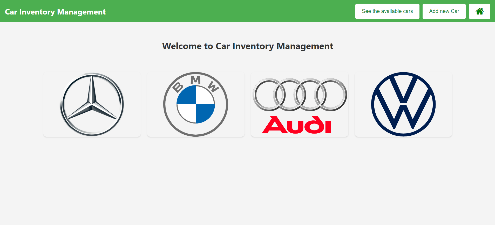
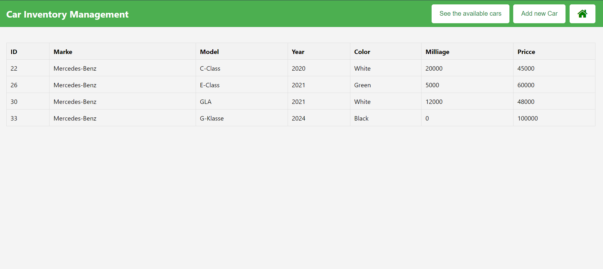
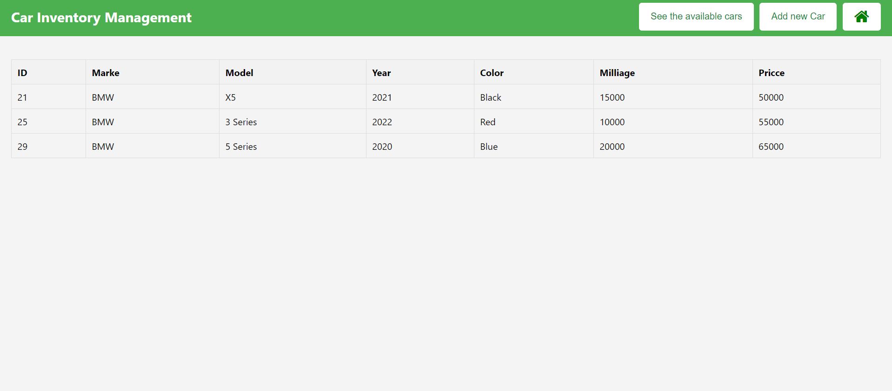
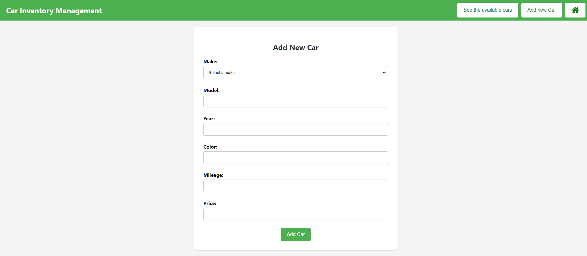

# Inventory Management System

Welcome to the Inventory Management System for Cars! This system is designed to help you manage and track the inventory of cars in your dealership. Built using Spring, HTML, and MySQL, it offers a robust and efficient way to handle car inventory.

##  Requirements
- Java 11 or higher
- Apache Maven
- MySQL Server
- Spring Framework

https://github.com/Mohmad-Naser-alnakeshbandi/InventoryManagementSystem.git

## Installation
Clone the repository 
`` 
git clone https://github.com/yourusername/inventory-management-system.git
``

## Database Information
The database for this project contains a table named cars which holds information about various car listings. Below are the details and an example of how to insert data into the cars table.

Table: cars
- The cars table has the following columns:
- color: The color of the car (e.g., 'Black', 'White', etc.)
- marke: The make/brand of the car (e.g., 'BMW', 'Mercedes-Benz', etc.)
- milliage: The mileage of the car (e.g., '15000' for 15,000 miles)
- model: The model of the car (e.g., 'X5', 'C-Class', etc.)
- price: The price of the car in dollars (e.g., '50000' for $50,000)
- year: The year the car was manufactured (e.g., '2021')

see the db.sql file to execute the needed sql commands
## End Point:

- http://localhost:8080/

- http://localhost:8080/cars

- http://localhost:8080/cars/Benz

- http://localhost:8080/cars/BMW

- http://localhost:8080/cars/Audi

- http://localhost:8080/cars/VW

- http://localhost:8080/cars/add
