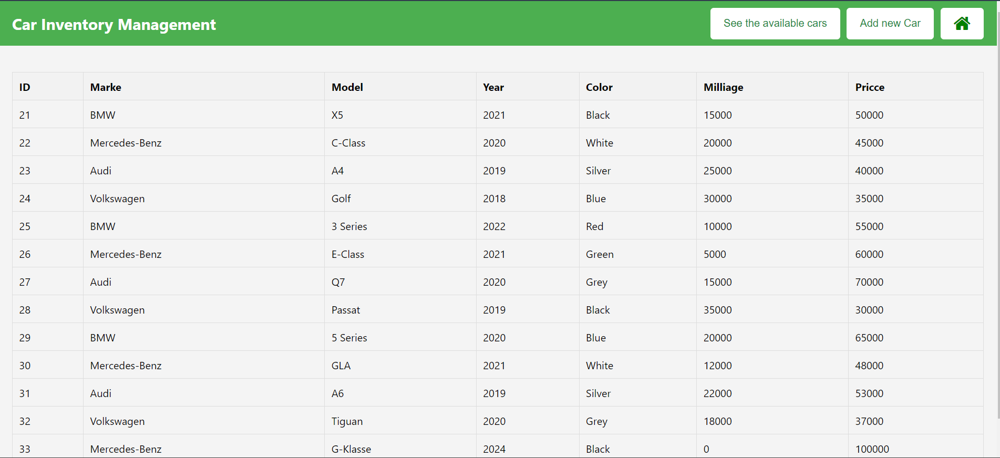

# Inventory Management System

Welcome to the Inventory Management System for Cars! This system is designed to help you manage and track the inventory of cars in your dealership. Built using Spring, HTML, and MySQL, it offers a robust and efficient way to handle car inventory.

##  Requirements
- Java 11 or higher
- Apache Maven
- MySQL Server
- Spring Framework

https://github.com/Mohmad-Naser-alnakeshbandi/InventoryManagementSystem.git

## Installation
Clone the repository 
`` 
git clone https://github.com/yourusername/inventory-management-system.git
``

## End Point:

- http://localhost:8080/

- http://localhost:8080/cars

- http://localhost:8080/cars/Benz

- http://localhost:8080/cars/BMW

- http://localhost:8080/cars/Audi

- http://localhost:8080/cars/VW

- http://localhost:8080/cars/add
